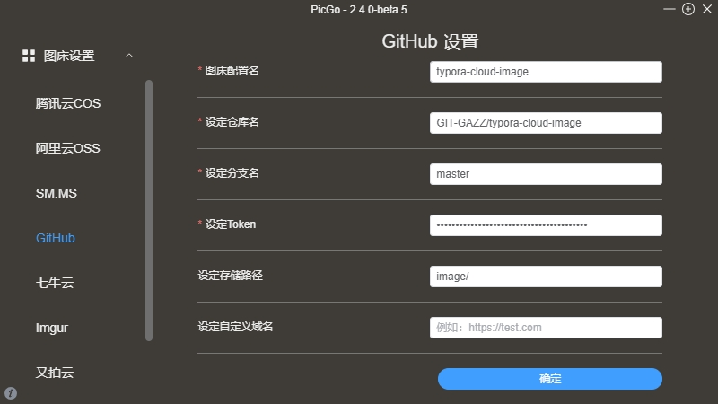

# 链接

[官网](https://typora.io/)
[中文官网](https://typoraio.cn/)
[快速开始](https://support.typoraio.cn/Quick-Start/)
[技术支持文档](https://support.typora.io/)

Typora使用的是 [GitHub Flavored Markdown](https://help.github.com/articles/github-flavored-markdown/)，简称GFM

# 快捷键

## 基础快捷键

| 快捷键                 | 说明           |
| ---------------------- | -------------- |
| `Ctrl` + `/`           | 切换源代码模式 |
| `Ctrl` + `1 - 6`       | 切换标题等级   |
| `Ctrl` + `Shift` + `K` | 切换代码块     |

## 表格相关快捷键

| 快捷键                                                       | 说明     |
| ------------------------------------------------------------ | -------- |
| `Ctrl` + `T`                                                 | 添加表格 |
| `Ctrl` + `Enter`                                             | 插入一行 |
| `Ctrl` + `Shift` + `Backspace`<br />`Ctrl` + `Shift` + `Delete` | 删除一行 |
| `Alt` + `↑`<br />`Alt` + `↓`<br />`Alt` + `←`<br />`Alt` + `→` | 移动行列 |

# 集成Pandoc插件

[点击跳转](./Pandoc.md)至Pandoc笔记

# 图片上传功能

[点击查看](https://support.typora.io/Upload-Image/)图片上传功能支持文档，可以一次性上传所有图片，请在支持文档中查看

该功能默认没有开启，需要在Typora的偏好设置中打开图片上传功能，图片上传的工具有多种：

* [PicGo-Core][PicGo-Core] (command line)
* [PicGo][PicGo] (app)
* PicList
* 自定义命令
* MinIO

## PicGo-Core (command line)

### GitHub图床

1. GitHub创建一个公共仓库和一个[token](https://github.com/settings/tokens)

2. 偏好设置-图像-上传服务-选择`PicGo-Core (command line)`，并点击设置下方的下载按钮来安装插件

3. 配置PicGo-Core，[点击查看](https://picgo.github.io/PicGo-Core-Doc/zh/guide/config.html)配置文件说明

   ```json
   {
   	"picBed": {
   		"github": {
   			"repo": "GIT-GAZZ/typora-cloud-image",
   			"token": "...",
   			"path": "image/",
   			"customUrl": "",
   			"branch": "master"
   		},
   		"current": "github",
   		"uploader": "github"
   	},
   	"picgoPlugins": {}
   }
   ```


## PicGo (app)

### GitHub图床

1. GitHub创建一个公共仓库和一个[token](https://github.com/settings/tokens)

2. [下载](https://github.com/Molunerfinn/PicGo/releases)并安装PicGo应用程序

3. 配置GitHub图床

   

4. 下载并安装`rename-file`插件，插件配置如下：

   ```
   {origin}-{hash}
   ```

   [点击查看](https://github.com/liuwave/picgo-plugin-rename-file)配置说明

5. 偏好设置-图像-上传服务-选择`PicGo (app)`


[PicGo-Core]: https://picgo.github.io/PicGo-Core-Doc/	"PicGo-Code中文官网"
[PicGo]: https://picgo.github.io/PicGo-Doc/	"PicGo中文官网"
